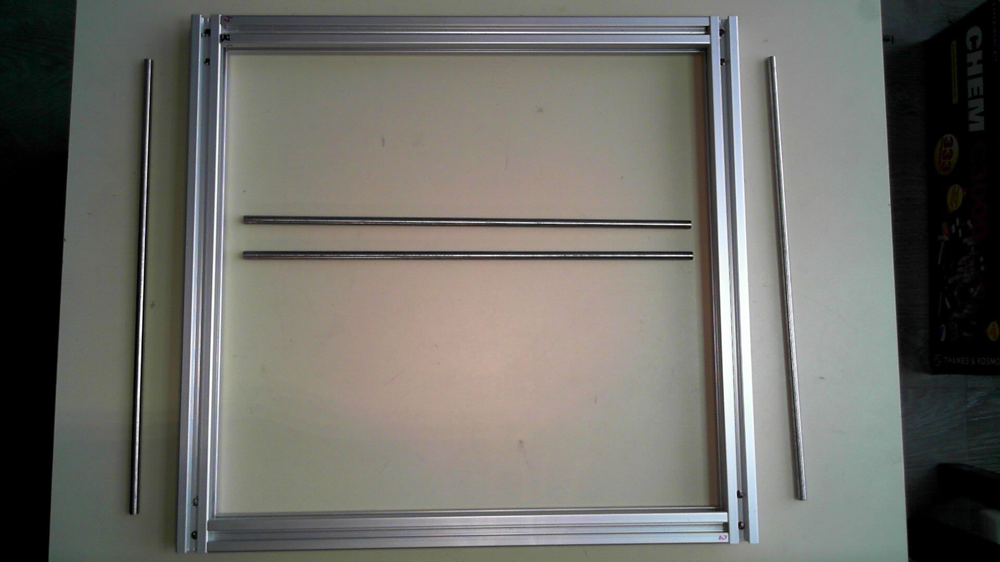

# HelpStation
The HelpStation is a tool that makes assembling electronics much easier.
## Features
* X/Y manually movable gantry for accurate positioning of a vacuum pickup tool
* Close up camera and illumination
# Project structure
* [documentation](documentation/index.md) contains HelpStation documentation, logs, research, papers, datasheets and more.
* [electronics](electronics/README.md) contains all the electronic hardware used in HelpStation.
* [firmware](firmware/README.md) contains all the embedded software used in the HelpStation.
* [software](software/README.md) contains all the software used in the HelpStation.
* [mechanical](mechanical/README.md) contains all the CAD drawings, mostly 3d printable objects.
## Cloning
This repository makes extensive use of submodules, use ```git clone --recurse-submodules https://github.com/Squantor/HelpStation.git``` to clone everything in one go.
# Photos
Current state:

